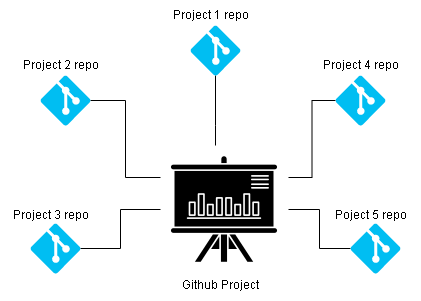

# CMPG-323-Overview-33572798
This is my overview repository for all my CMPG 323 projects. 

## Branching Strategies
My branching strategy for all my CMPG 323 projects is Trunk based development. Trunk based development is a strategy whereby the developer(s) merge changes directly to the main branch(trunk).By changes I am referring to small frequent updates. This practice promotes continuous development.
<a href = "https://trunkbaseddevelopment.com/">Read more<a/> about  Trunk based development

See below the diagram representation of the approach.

## Project and Repository Structure
Every CMPG 323 project will have its own repository. However all the repositories will share a Gitthub project. 
That means I will have five repositories for five CMPG projects with one Gitthub project.
 See the diagram below for structural representation.
  

  
  
  ## .gitignore file & Credentials Storage

Links to resources:
<a href = “https://www.optimizely.com/optimization-glossary/trunk-based-development/”>Trunk based development<a/>
<a href = “#”><a/>
<a href = “#”><a/>
